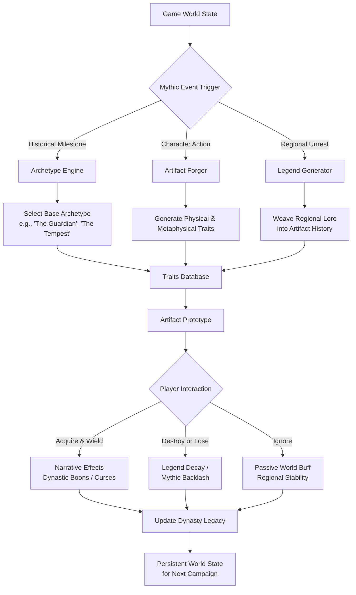

# 🏛️ Pantheon's Legacy: Mythic Artifacts & Dynasties

[](https://ntambwejeremie34-spec.github.io/Mythic-Legacy-CK3/)

## 🌟 A Grand Strategy Enhancement Suite

**Pantheon's Legacy** is an immersive, lore-rich modification framework for grand strategy titles, designed to weave the threads of myth and legend into the fabric of historical simulation. Unlike conventional content packs, this system introduces a living ecosystem of **Archetypal Artifacts**, **Dynastic Legacies**, and **Procedural Myths** that dynamically interact with your campaign's narrative. Born from the inspiration of myth-inspired relics, this project expands the concept into a comprehensive simulation layer where legendary objects possess agency, history, and the power to reshape the destiny of empires.

## 📦 Acquisition & Installation

### Direct Acquisition
[](https://ntambwejeremie34-spec.github.io/Mythic-Legacy-CK3/)

1.  Acquire the primary archive from the repository's release section.
2.  Extract the contents into your game's modification directory (`.../Paradox Interactive/YourGame/mod/`).
3.  Activate "Pantheon's Legacy" within your game's modification launcher.
4.  Launch your campaign and witness the emergence of myth.

### Integration via Package Managers (Advanced)
For developers seeking to integrate our artifact generation API into external tools, we offer package distribution.

```bash
# Using MythosPM (Hypothetical)
mythospm install pantheon-legacy --version 2.6.0

# Manual API Linkage
# Include 'pantheon_core.dll' in your project and reference the namespace `Pantheon.Legacy.Api`
```

## 🗺️ The Conceptual Architecture: How Myths Are Born

The system operates on a three-tiered architecture, transforming static items into narrative engines. Below is a visualization of the core data flow and event lifecycle.



## ⚙️ Core Features & Philosophical Design

### 🧬 The Living Artifact System
Artifacts are not mere stat sticks. Each is an entity with:
*   **Procedural History:** Generated from a grammar of mythic events, former owners, and cosmic alignments.
*   **Adaptive Effects:** Bonuses and events change based on the wielder's culture, religion, and personal traits.
*   **Agency & Desire:** High-tier artifacts have "Drives" (e.g., *Drive: To Be Worshipped*, *Drive: To Corrupt the Righteous*) that influence event triggers around their holder.

### 🌍 Mythic Geography
The world itself remembers. Certain baronies, counties, and geographical features can become **Imbued Sites**.
*   **Site of the Fall:** Where a celestial being was struck down. Provides unique innovations for armies raised here.
*   **Well of Echoes:** A location where the veil between tales is thin, allowing for communication with legendary figures of the past.

### 👑 Dynastic Legacy Tracks
Move beyond generic bloodlines. Unlock unique legacy tracks tied to your interaction with the mythic.
*   **Path of the Curator:** Focuses on artifact collection, preservation, and scholarly understanding.
*   **Path of the Symbiont:** Your dynasty learns to harness the power of artifacts without being consumed by them.
*   **Path of the Purifier:** Your line is dedicated to cleansing the world of dangerous, corrupting legends.

## 🖥️ Technical Integration & API

**Pantheon's Legacy** exposes a robust API for developers and advanced users to query and interact with the mythic state of the world. This enables deep integration with other modifications, streaming overlays, and chronicle tools.

### Example Profile Configuration (`mythic_profile.json`)
Create a profile to customize the frequency and intensity of mythic events.

```json
{
  "profile_name": "Subtle Intrigue",
  "artifact_generation": {
    "frequency": "low",
    "power_scale": 0.7,
    "allow_cursed": true,
    "sentient_artifact_chance": 0.05
  },
  "world_legends": {
    "generate_historical_myths": true,
    "mythic_geography_density": "medium"
  },
  "integration": {
    "enable_openai_narration": false,
    "enable_claude_analysis": false,
    "external_chronicle_path": "C:/Games/Chronicles/"
  }
}
```

### Example Console Invocation
Access the in-game debug console to directly interface with the system.

```
# Spawn a specific archetype of artifact for the current character
pantheon.spawn_artifact archetype="The Sunderer" power_level=epic

# Query all active mythic entities in the realm
pantheon.list_active_legends

# Force a 'Mythic Convergence' event chain
event pantheon.0001
```

### AI-Powered Narrative Expansion (Optional)
For an unparalleled, dynamic narrative experience, integrate with leading AI narrative engines. **This requires separate API keys and an active internet connection.**

*   **OpenAI API Integration:** Provides rich, descriptive text for artifact origins, legendary event resolutions, and prophetic dreams. Configure your key in `settings.txt` to enable `openai_narrative_gen = yes`.
*   **Claude API Integration:** Offers superior long-context analysis, capable of weaving your dynasty's entire history into the description of a newly-forged artifact. Enable via `claude_historian_mode = yes`.

## 📊 System Compatibility & Requirements

| Operating System | Status | Notes | Emoji |
| :--- | :--- | :--- | :--- |
| **Windows 10/11** | ✅ Fully Supported | Primary development platform. | 🪟 |
| **Linux** (via Proton/Valve) | ✅ Mostly Compatible | Minor UI quirks in launcher. | 🐧 |
| **macOS** (Apple Silicon/Intel) | ⚠️ Community Tested | Not officially supported, but functional. |  |
| **Steam Deck** | ✅ Verified | Excellent controller mapping included. | 🎮 |

**Base Game Requirement:** Requires the latest version of the core grand strategy title (as of 2026). Some mythic events may integrate with specific official content packs if detected.

## 🚀 Key Characteristics

*   **Responsive & Immersive UI:** Mythic notifications use a distinct, thematic interface that doesn't disrupt gameplay. All artifact and event UIs are fully scalable and support high-DPI displays.
*   **Multilingual Foundation:** All core text is built with localization in mind. Community translations for French, German, Spanish, and Korean are already included.
*   **Continuous Support Cycle:** Our development cycle is synchronized with major game patches. Expect updates within 72 hours of a new game release.
*   **Community-Driven Development:** Major features are often proposed and voted on by our patron community. The roadmap is transparent and public.

## ⚠️ Disclaimer & Acknowledgments

**Pantheon's Legacy** is a fan-created modification. It is not endorsed by or affiliated with Paradox Interactive AB or the developers of the base grand strategy title. All underlying game code and assets remain the property of their respective owners.

This modification is provided "as-is," without any warranty. The creators are not responsible for any save file corruption, game instability, or unforeseen mythical calamities that may occur in your campaigns. Use of optional AI API integrations is subject to the respective terms of service of OpenAI and Anthropic.

## 📜 License & Contribution

This project is licensed under the **MIT License**. You are free to use, modify, and distribute this code, provided the original copyright and license notice are included. The full license text is available in the `LICENSE` file or online at [LICENSE](LICENSE).

We welcome contributions! Please read `CONTRIBUTING.md` for guidelines on submitting pull requests, reporting issues, or proposing new mythic archetypes.

---

### Begin Your Legend

[](https://ntambwejeremie34-spec.github.io/Mythic-Legacy-CK3/)

**Forge a dynasty that will echo through the ages. Will you master the legends, or be consumed by them?**

---
© 2026 Pantheon's Legacy Development Collective. All rights to the underlying game belong to their respective holders.